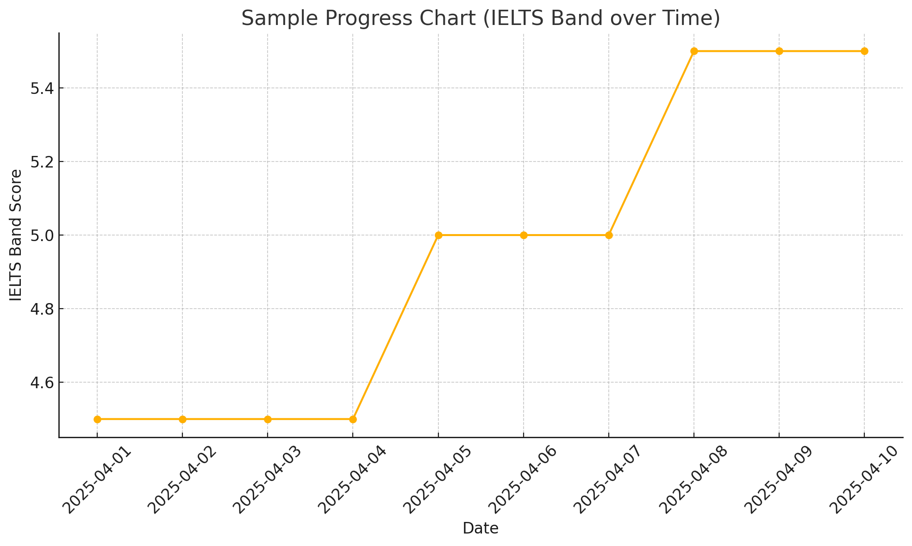

# 📈 English‑Log — Daily 30‑Minute English Practice

**A self‑contained template that lets you run a 30‑minute, AI‑assisted English lesson every weekday and track your speaking progress automatically.** Fork it, follow the prompt, and your GitHub repo becomes a living study journal.

---

## 🚀 Why use this project?
* **Zero vendor lock‑in** – just GitHub, your browser, and ChatGPT.
* **Everything version‑controlled** – passage, transcript, feedback.
* **Built‑in automations** – commits and progress chart handled by GitHub Actions.
* **Future‑ready** – when ChatGPT’s *Model Context Protocol* (MCP) arrives, the model can push study files directly via a GitHub connector.

---

## ⚡ Quick Start
1. **Fork or clone** this repo.
2. **Open ChatGPT** and send the starter message **plus this README link** so the model can follow the workflow:

   ```text
   I’m using the English‑Log template at https://github.com/<your‑user>/english-log
   Please follow the README workflow.
   Level = B1   # ← initial CEFR level
   Start        # ← begins the 30‑minute session
   ```
3. ChatGPT returns three code blocks—`reading.md`, `speaking.md`, `feedback.json`—save them under `english-log/YYYY-MM-DD/`, commit, and push.
4. The *log‑commit* workflow uploads the files **and refreshes the progress chart automatically**.

---

## ⚙️ Initial Setup (one‑time)
1. Fork/clone ✓  
2. Ensure GitHub Actions are enabled (default).  
3. No extra secrets—workflows use `GITHUB_TOKEN` automatically.

---

## 🔄 Daily Flow
1. **Topic (optional)** – `Topic = travel`; skip to auto‑rotate themes.  
2. **Reading (~10 min)** – ChatGPT provides a leveled passage → you read aloud.  
   *Saved to `reading.md`.*  
3. **Speaking (~15 min)** – AVM Q&A + 1‑min summary.  
   *Transcript **and voice feedback** saved to `speaking.md`.*  
4. **Feedback (~5 min)** – IELTS band + strengths & improvements.  
   *Summary saved to `feedback.json`.*  
5. Push the folder → workflow commits & updates chart.  
6. Next session reads yesterday’s feedback to adjust difficulty.

---

## 🗂 Repository Layout
```text
english-log/
└─ YYYY-MM-DD/        # one folder per study day
   ├─ reading.md      # passage
   ├─ speaking.md     # transcript + feedback
   └─ feedback.json   # scores & notes
assets/
└─ progress.png       # auto‑generated chart
.github/workflows/
└─ log-commit.yml     # main automation
README.md
```

---

## 📝 `feedback.json` Reference
| Field | Type | Description |
|-------|------|-------------|
| `date` | string | `YYYY-MM-DD` session date |
| `reading_seconds` | number | Reading duration (s) |
| `comprehension_score` | 0‑3 | T/F quiz correct |
| `ielts_band` | 0‑9 | Speaking band estimate |
| `words_per_min` | number | Fluency rate |
| `strengths` | string[] | What went well |
| `improvements` | string[] | Focus for next time |
| `notes` | string[] | Pronunciation/pacing remarks |

*Example*
```json
{
  "date": "2025-04-22",
  "reading_seconds": 138,
  "comprehension_score": 3,
  "ielts_band": 5.0,
  "words_per_min": 96,
  "strengths": ["clear structure", "good intonation"],
  "improvements": ["expand vocabulary", "reduce pauses"]
}
```

---

## 📊 Progress Chart
Whenever `feedback.json` changes, GitHub Actions regenerate **`assets/progress.png`** so you can see your growth at a glance.



---

> *Happy learning! Every folder is one brick in your fluency wall.* 🧱

